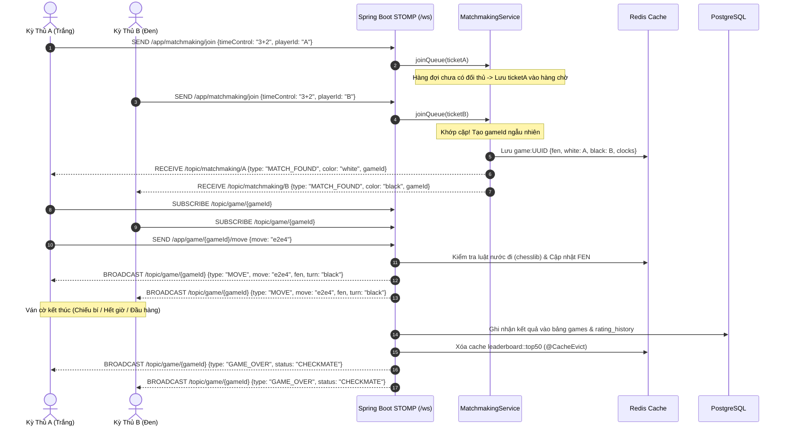

# 🏰 KIẾN TRÚC TỔNG THỂ HỆ THỐNG CỜ VUA TRỰC TUYẾN (CHESS PLATFORM ARCHITECTURE)

Tài liệu này mô tả chi tiết toàn bộ kiến trúc kỹ thuật, luồng dữ liệu, hạ tầng đa dịch vụ (microservices), cơ chế bộ nhớ đệm (Redis caching), giao thức thời gian thực (WebSocket STOMP), và mô hình triển khai của hệ thống **ChessMaster Platform**.

---

## 1. Sơ Đồ Kiến Trúc Tổng Thể (System Architecture Diagram)

```mermaid
graph TD
    Client["Client Browser<br/>(Desktop / Mobile)"]

    subgraph Gateway ["Reverse Proxy & Ingress"]
        Nginx["Nginx Reverse Proxy<br/>Port 80"]
    end

    subgraph FrontendApp ["Presentation Tier"]
        NextJS["Next.js 15 + React 19<br/>Port 3000<br/>• 2D/3D Staunton Board (Three.js)<br/>• Web Audio Sound Engine<br/>• Game Review & Advantage Graph<br/>• i18n (VI / EN)"]
    end

    subgraph CoreBackend ["Core Business Tier"]
        SpringBoot["Java Spring Boot 3.3.4<br/>Port 8080<br/>• Spring Security + Stateless JWT<br/>• REST APIs (Auth, Users, Games, Leaderboard)<br/>• STOMP WebSocket (/ws)<br/>• Matchmaking Engine<br/>• Spring Cache Abstraction"]
    end

    subgraph DataStorage ["Data & Cache Tier"]
        Postgres[("PostgreSQL Database<br/>Port 5432<br/>• Users, Games, Rating History<br/>• Flyway Migrations (v1, v2, v3)")]
        RedisCache[("Redis 7 In-Memory<br/>Port 6379<br/>• Leaderboard Top 50 (5m TTL)<br/>• User Profiles (15m TTL)<br/>• Live Game States & Clocks<br/>• Matchmaking Queue<br/>• Stockfish AI Move Cache (24h TTL)")]
    end

    subgraph HighPerfServices ["Specialized Engine Services"]
        GoRealtime["Golang Gateway<br/>Port 8085<br/>• Millisecond Clocks<br/>• High-concurrency WebSockets"]
        RustEngine["Rust Analysis Engine<br/>Port 8002<br/>• Move Validation<br/>• Anti-cheat Anomaly Detection"]
        PythonStockfish["Python FastAPI AI Service<br/>Port 8001<br/>• Stockfish 17 NNUE Engine"]
    end

    Client -->|HTTP / HTTPS| Nginx
    Client -->|WebSockets (STOMP)| Nginx

    Nginx -->|/ & static assets| NextJS
    Nginx -->|/api/* & /ws/*| SpringBoot
    Nginx -->|/go-ws/*| GoRealtime
    Nginx -->|/rust/*| RustEngine

    NextJS -.->|API Rewrite in Dev /api/spring/*| SpringBoot

    SpringBoot -->|JPA / Hibernate| Postgres
    SpringBoot -->|Lettuce Client / Cache| RedisCache
    SpringBoot -->|HTTP AI Calls| PythonStockfish
    SpringBoot -->|Engine Analysis| RustEngine
```

---

## 2. Chi Tiết Các Tầng Công Nghệ (Technology Stack)

### 2.1. Presentation Tier (Frontend — `chess-frontend`)
* **Framework:** Next.js 15 (App Router), React 19, TypeScript.
* **Styling & UI:** Tailwind CSS, Glassmorphism design system, Lucide icons, Dark/Light theme mode.
* **3D Chess Graphics:** Three.js, `@react-three/fiber`, `@react-three/drei`, Staunton custom procedural geometries.
* **2D Chessboard & Rules:** `react-chessboard`, `chess.js` (rule validation, FEN/PGN parser).
* **Game Review & Analytics:** Công cụ phân tích thế trận Stockfish tích hợp sẵn biểu đồ ưu thế theo dòng thời gian (Advantage Graph SVG) phân loại nước đi (*Brilliant, Best, Great, Inaccuracy, Mistake, Blunder*).
* **Audio Engine:** `soundManager` dựa trên Web Audio API tổng hợp âm thanh không trễ (move, capture, check, castle, victory, defeat, low time warning).
* **Realtime STOMP Hook:** `useMultiplayerSocket` kết nối WebSocket STOMP với cơ chế dự phòng SockJS.

### 2.2. Core Backend Tier (`chess-backend`)
* **Framework:** Java 21, Spring Boot 3.3.4.
* **Security & Auth:** Spring Security 6 với kiến trúc không trạng thái (Stateless JWT), mã hóa mật khẩu BCrypt, bộ lọc `JwtAuthFilter`.
* **Database Access:** Spring Data JPA, Hibernate ORM, kết nối HikariCP pool.
* **Database Migrations:** Flyway tự động kiểm soát phiên bản cấu trúc cơ sở dữ liệu (`V1__create_users.sql`, `V2__create_games.sql`, `V3__add_user_profile_columns.sql`).
* **Realtime Protocol:** WebSocket STOMP Message Broker (`/app`, `/topic`, `/queue`, `/user`), bộ điều khiển ghép trận `MatchmakingService`.
* **Caching Engine:** `spring-boot-starter-cache` kết hợp `LettuceConnectionFactory`, serialize JSON hỗ trợ Java 8/Time module (`GenericJackson2JsonRedisSerializer`).

---

## 3. Kiến Trúc Bộ Nhớ Đệm Redis (Redis Caching Architecture)

Để tối ưu hóa hiệu năng hệ thống dưới tải trọng cao và giảm thiểu truy vấn trùng lặp xuống PostgreSQL, tầng Redis Cache được cấu hình với các chính sách TTL (Time-To-Live) chuyên biệt:

| Không Gian Tên (Namespace) | Khóa (Cache Key) | Thời Gian Hết Hạn (TTL) | Cơ Chế Xóa Cache (Eviction Policy) | Mục Đích Sử Dụng |
| :--- | :--- | :--- | :--- | :--- |
| **`leaderboard`** | `'top50'` | **5 phút** | Xóa ngay khi có ván cờ tính điểm (rated) kết thúc (`@CacheEvict`) | Giảm tải truy vấn sắp xếp `ORDER BY elo_rating DESC` trên toàn bộ bảng người dùng |
| **`userProfile`** | `#username.toLowerCase()` | **15 phút** | Xóa khi người dùng cập nhật thông tin (`updateProfile`) | Lưu trữ hồ sơ người chơi, ảnh đại diện, danh hiệu và quốc gia |
| **`userDetails`** | `#username` | **10 phút** | Xóa khi người dùng đổi mật khẩu hoặc đăng xuất | Tăng tốc độ xác thực JWT trên từng request API |
| **`gameDetail`** | `#gameId` | **1 giờ** | Bất biến (Immutable) sau khi ván đấu đã kết thúc | Lưu trữ biên bản PGN, kết quả và thông tin 2 kỳ thủ |
| **`recentGames`** | `#username` | **3 phút** | Xóa khi người chơi hoàn thành ván đấu mới | Danh sách các ván đấu gần nhất của người chơi |
| **`aiMoves`** | `#fen + ':' + #difficulty` | **24 giờ** | Tự hết hạn theo TTL | Lưu nước đi tối ưu của Stockfish cho cùng một thế cờ và độ khó |
| **`game:<gameId>`** | Key giá trị trực tiếp | **3 giờ** | Lưu trực tiếp trạng thái ván cờ trực tuyến đang diễn ra | Đồng bộ trạng thái FEN, lượt đi, và đồng hồ đếm ngược |

---

## 4. Luồng Ghép Trận & Chơi Cờ Thời Gian Thực (Multiplayer Flow)



---

## 5. Cấu Trúc Thư Mục Dự Án (Repository Structure)

```
Chess-Projects/
├── .github/
│   └── workflows/
│       └── ci.yml               # GitHub Actions CI (ESLint, Prettier, Next.js Build, Maven Compile)
├── ARCHITECTURE.md              # Tài liệu kiến trúc toàn diện (Tài liệu này)
├── chess-platform/
│   ├── .editorconfig            # Quy chuẩn định dạng code (tab, indent, charset)
│   ├── .env                     # Biến môi trường chung (DB_PASS, JWT_SECRET...)
│   ├── docker-compose.yml       # Điều phối toàn bộ các dịch vụ bằng 1 lệnh
│   ├── nginx/
│   │   └── nginx.conf           # Reverse proxy routing cổng 80 -> Frontend, Backend, Engines
│   ├── chess-frontend/          # Ứng dụng Next.js 15
│   │   ├── app/                 # App Router (pages: play, learn, puzzles, leaderboard, profile)
│   │   ├── components/          # UI components (2D/3D board, modals, Advantage Graph)
│   │   ├── context/             # AuthContext, LanguageContext, ThemeContext
│   │   ├── hooks/               # useChessGame, useMultiplayerSocket
│   │   ├── lib/                 # apiClient, chessReviewEngine, soundEffects, translations
│   │   └── public/              # Hình ảnh đại diện kiện tướng thế giới, avatar user, âm thanh
│   ├── chess-backend/           # Dịch vụ Spring Boot 3.3.4
│   │   ├── pom.xml              # Maven dependencies (Web, Security, Redis, JPA, Flyway)
│   │   └── src/main/java/com/chess/
│   │       ├── ai/              # Stockfish AI integration & AI move caching
│   │       ├── auth/            # JWT Token provider, UserDetails & Login/Register
│   │       ├── config/          # RedisCacheConfig, SecurityConfig, WebSocketConfig
│   │       ├── game/            # GameService, GameRestController, GameWebSocketController
│   │       ├── leaderboard/     # LeaderboardService (Top 50 Redis cache)
│   │       ├── matchmaking/     # MatchmakingService (hàng chờ ghép cặp)
│   │       └── user/            # UserService, UserController, User Entity
│   ├── chess-ai-service/        # Dịch vụ Python FastAPI tính toán nước đi AI Stockfish
│   ├── chess-engine-rust/       # Động cơ Rust phân tích gian lận & nước đi hiệu năng cao
│   └── chess-realtime-go/       # Cổng WebSocket Go quản lý đồng hồ milli-giây
```

---

## 6. Hướng Dẫn Vận Hành (Operations & Deployment Guide)

### 6.1. Chạy Ở Môi Trường Phát Triển Cục Bộ (Local Development)
1. **Khởi động cơ sở dữ liệu & Redis:**
   ```bash
   cd chess-platform
   docker compose up -d postgres redis
   ```
2. **Khởi động Spring Boot Backend:**
   ```bash
   cd chess-backend
   $env:DB_PASS="chess_secret_dev"; $env:REDIS_HOST="localhost"; java -jar target/chess-backend-1.0.0-SNAPSHOT.jar
   # Backend chạy tại http://localhost:8080 (Kiểm tra: /actuator/health)
   ```
3. **Khởi động Next.js Frontend:**
   ```bash
   cd chess-frontend
   npm run dev
   # Giao diện web chạy tại http://localhost:3000
   ```

### 6.2. Triển Khai Toàn Diện Với Docker Compose (Production Deployment)
Khởi chạy toàn bộ hệ thống microservices (Nginx, Frontend, Backend, AI Service, Go Gateway, Rust Engine, PostgreSQL, Redis) với một câu lệnh:
```bash
cd chess-platform
docker compose up -d --build
```
Truy cập ứng dụng hoàn chỉnh tại cổng **`http://localhost`** thông qua Nginx Reverse Proxy.
